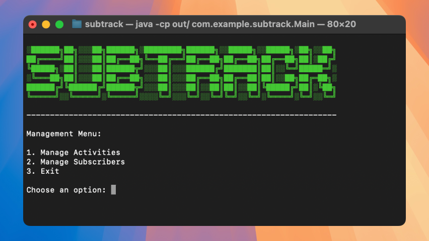
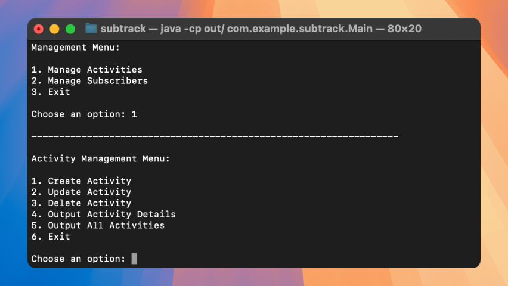

# <samp>OVERVIEW</samp>

Subscription management system written in Java.



# <samp>GUIDANCE</samp>

### Compile and execute

```shell
javac -d out/ src/com/example/subtrack/**/*.java
java -cp out/ com.example.subtrack.App
```
